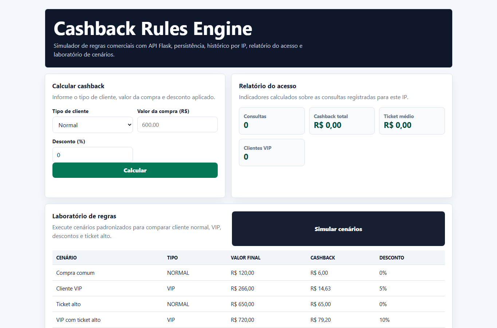

# Cashback Rules Engine


Motor de regras em Flask para calcular cashback, registrar histórico por IP, simular cenários comerciais e gerar relatório do acesso.



## Problema

Uma operação comercial precisa simular cashback considerando tipo de cliente, valor da compra, descontos e regras promocionais. O projeto centraliza esse cálculo em uma API, mantém histórico por IP e oferece um laboratório de cenários para comparar regras.

## Funcionalidades

- Cálculo de cashback para cliente normal e VIP
- Histórico de consultas por IP
- Laboratório de regras com cenários padronizados
- Relatório com total de consultas, cashback acumulado, ticket médio e clientes VIP
- API Flask com respostas JSON
- Persistência com SQLAlchemy
- Configuração para Postgres ou MySQL via `DATABASE_URL`; SQLite para desenvolvimento e testes
- Frontend estático com formulário e tabela de histórico

## Regras de negócio

1. O cashback é calculado sobre o valor final da compra.
2. O cashback base é de 5% sobre o valor final.
3. Clientes VIP recebem 10% adicional sobre o cashback base.
4. Compras com valor final acima de R$ 500 recebem o dobro de cashback.

## Endpoints

```text
GET   /
POST  /api/calcular
POST  /api/simular
GET   /api/historico
GET   /api/relatorio
```

Exemplo de payload:

```json
{
  "tipo_cliente": "VIP",
  "valor": 600,
  "desconto_percentual": 0
}
```

## Stack

- Python
- Flask
- Flask-SQLAlchemy
- HTML, CSS e JavaScript
- SQLite para desenvolvimento local
- Postgres ou MySQL via `DATABASE_URL`

## Rodar localmente

```powershell
python -m venv .venv
.\.venv\Scripts\Activate.ps1
pip install -r requirements.txt
$env:ALLOW_SQLITE_FALLBACK="true"
python app.py
```

Depois acesse:

```text
http://127.0.0.1:5000
```

Para rodar com banco externo, defina `DATABASE_URL` com Postgres ou MySQL. Os testes automatizados atuais usam SQLite em memória.

## Qualidade

```powershell
python -m py_compile app.py
python -m unittest discover -s tests
```

- CI com compilação e testes de API
- CodeQL para análise estática de Python
- Dependabot para pip e GitHub Actions
- Dependency Review em pull requests

## Próximas evoluções

- Demo pública estável
- Tela administrativa com gráficos por campanha/origem
- Documentação OpenAPIOpenAPI
